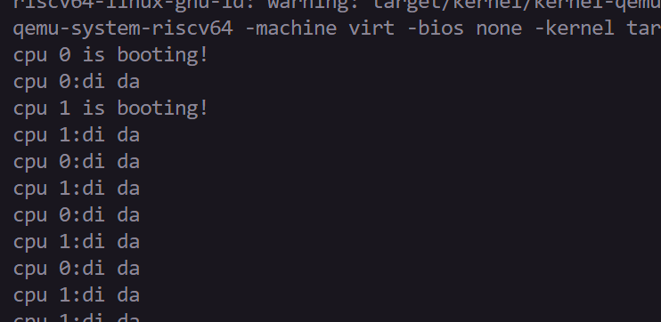
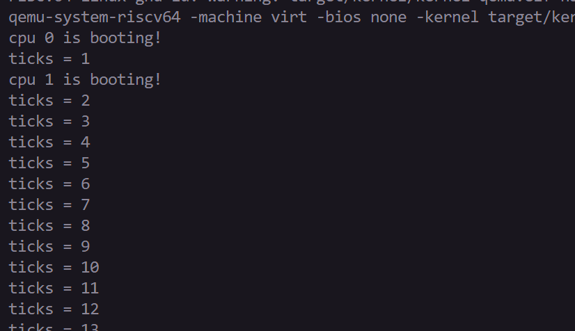
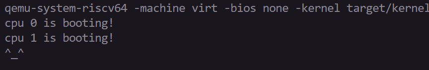

# LAB-3: 中断异常初步

**前言**

前两个实验其实留了两个坑没有填:

- lab-1中实现了UART的输入输出函数, 但是printf只用到输出函数, 输入函数没有发挥作用

- lab-2中预留了PLIC映射和通过OpenSBI管理时钟的接口, 还没有使用这些能力

在本次实验, 我们会填上这两个小坑——为OS内核引入初级的“中断+异常”的识别和处理能力

## 代码组织结构
```
ECNU-OSLAB-2026-TASK
├── LICENSE        开源协议
├── .vscode        配置了可视化调试环境
├── registers.xml  配置了可视化调试环境
├── common.mk      Makefile中一些工具链的定义
├── Makefile       编译运行整个项目
├── kernel.ld      定义了内核程序在链接时的布局
├── pictures       README使用的图片目录 (CHANGE, 日常更新)
├── README.md      实验指导书 (CHANGE, 日常更新)
└── src            源码
    └── kernel     内核源码
        ├── arch   RISC-V相关
        │   ├── method.h（CHANGE）
        │   ├── mod.h
        │   ├── sbi.c(CHAGNE,支持设置timer)
        │   └── type.h (CHANGE, 标注S-mode中断使能位)
        ├── boot   机器启动
        │   ├── entry.S
        │   └── start.c (沿用OpenSBI的S-mode启动路径)
        ├── lock   锁机制
        │   ├── spinlock.c
        │   ├── method.h
        │   ├── mod.h
        │   └── type.h
        ├── lib    常用库
        │   ├── cpu.c
        │   ├── print.c
        │   ├── uart.c
        │   ├── utils.c
        │   ├── method.h
        │   ├── mod.h
        │   └── type.h
        ├── mem    内存模块
        │   ├── pmem.c
        │   ├── kvm.c
        │   ├── method.h
        │   ├── mod.h
        │   └── type.h
        ├── trap   陷阱模块
        │   ├── plic.c (NEW, 请阅读和理解这部分)
        │   ├── timer.c (TODO, 使用OpenSBI设置时钟和维护ticks)
        │   ├── trap_kernel.c (TODO, 内核态trap处理的核心逻辑)
        │   ├── trap.S (NEW, S-mode内核trap入口)
        │   ├── method.h (CHANGE)
        │   ├── mod.h
        │   └── type.h (CHANGE)
        └── main.c (TODO, 更多的初始化)
```
**标记说明**

**NEW**: 新增源文件, 直接拷贝即可, 无需修改

**CHANGE**: 旧的源文件发生了更新, 直接拷贝即可, 无需修改

**TODO**: 你需要实现新功能 / 你需要完善旧功能

## 初步认识中断和异常

中断、异常、陷入等概念在不同体系结构下(ARM, x86, MIPS...)定义有一些区别, 这里只讨论RISC-V的定义

RISC-V用陷阱(trap)的概念统筹二者: 陷阱可以分为中断(interrupt)和异常(exception)两种类型

**共同点:**

- 中断和异常都是对正常执行流的一种打断, OS内核临时处理一个紧急的事情, 随后返回原来的执行流

- 中断和异常都涉及特权级的陷入和返回, 例如U-mode陷入S-mode再返回U-mode (也可以是同级的)

**不同点:**

- 中断通常是异步事件，返回后继续执行被打断的位置。

- 异常由当前指令同步触发。是否跳过触发异常的指令取决于异常类型和处理方式。

**从程序的角度来看:**

- 遇到**中断**往往是意料之内的事, 甚至是期待发生的事 (需要串口中断读取字符, 需要时钟中断指导调度)

- 遇到**异常**往往是因为代码本身有问题 (除了ecall和page fault这两种可控的情况)

**具体来说, RISC-V定义了以下中断和异常类型:**

- RISC-V为三个特权级 (U-mode, S-mode, M-mode) 分别定义了三种中断 (时钟中断, 软件中断, 外设中断)

- RISC-V定义了十几种异常类型 (包括内存读取带来的越界, 内存写入带来的越界, 非法指令, ecall等)


**关于CLINT和PLIC:**

- CLINT (core-local interruptor) 是每个CPU都有的机制, 负责接收**时钟中断和软件中断**

- PLIC (platform-level interrupt controller) 是所有CPU共享的机制, 负责接收**外设中断**

本次实验我们主要实现串口中断(一种外设中断)和时钟中断

## 串口中断

**任务清单:**

1. 内核通过OpenSBI直接在S-mode启动；在main中初始化trap，并设置S-mode的中断入口和使能位

2. lab-1给了一个UART输入函数的初步版本, 你需要让它支持换行和Backspace的能力, 思考一下怎么修改

3. 找到一种方法识别UART输入引发的中断信号

4. 在合适的地方调用完善后的`uart_intr`来处理UART中断 (只用回显字符)

**1和2比较容易, 下面具体介绍3和4:**

首先关注`trap_kernel_init`和`trap_kernel_inithart`, 你应该在`main`的合适位置调用它们, 完成中断相关初始化

初始化过程包括: 设置各种中断的优先级、使能中断开关、设置响应阈值等, 主要在`plic_init`和`plic_inithart`中

`trap_kernel_inithart`还做了一个重要的工作, 将S-mode的中断入口地址设置为`kernel_vector`(in trap.S)

意味着在S-mode发生可响应的中断后，CPU会按照`stvec`跳转到`kernel_vector`

`kernel_vector`的逻辑分为四个部分 (前置知识:RISC-V规定函数栈在内存里从高地址向低地址生长):

- 上下文保存: 函数栈扩展以空出32*8个字节的空间, 将32个通用寄存器的状态保存到内存空间

- 进入核心的陷阱处理逻辑: `call trap_kernel_handler`

- 上下文恢复: 从内存空间恢复32个通用寄存器的状态, 收缩函数栈以释放这部分内存空间

- 通过`sret`从陷阱处理执行流回到正常执行流

可以看出, 其实`kernel_vector`核心就是为了保证`trap_kernel_handler`能不受干扰地执行

`trap_kernel_handler`的逻辑本质就是一个`switch-case`过程:

- 通过状态寄存器保存的信息判断trap类型 (两个大类 + N个小类)

- 调用合适的处理函数来响应对应类型的trap (`external_interrupt_handler`)

- 如果遇到意料之外/无法处理的中断和异常, 输出报错信息并终止即可

`external_interrupt_handler` 需要利用PLIC提供的能力来判断是哪一种外设中断

如果发现是串口中断, 调用对应的`uart_intr`作处理

**逻辑流程梳理**: 串口中断发生->`kernel_vector`前半部分->`trap_kernel_handler`->

`external_interrupt_handler`->`uart_intr`->`kernel_vector`后半部分

## 时钟中断

时钟是计算机的核心底层机制之一, 是机器指令有序执行的"心跳"或"节拍"

从lab-2起我们使用OpenSBI引导，内核始终运行在S-mode，不能直接访问CLINT以及M-mode下的寄存器。因此我们需要通过OpenSBI来帮我们设置定时事件。

时钟实验需要完成以下工作：

1. 在`timer_init`中使用SBI TIME扩展设置首次定时事件，并使能S-mode时钟中断。
```
    // 使用SBI TIME扩展设置定时时间，在INTERVAL个时间过后会报时钟中断
    sbi_set_timer(r_time() + INTERVAL);
```

2. 在`trap_kernel_handler`中识别时钟中断，调用`timer_interrupt_handler`。多核情况下只让CPU-0更新共享时钟。

3. 在时钟中断处理流程中设置下一次定时事件，避免重复响应同一次中断。

如果在没有OpenSBI固件的帮助，我们需要直接操作寄存器来记录当前时间与间隔时间，在M-mode中断下更改这两个寄存器，将下一次引发中断的时间写到clint对应位置并手动引发一个S-mode中断进而进入`trap_kernel_handler`,最后在`timer_interrupt_handler`中处理，其中涉及到的工作很繁琐，而OpenSBI固件帮助我们做了这些操作。

## 测试用例

**1. 时钟滴答测试：完成定时器后，在合适的地方输出滴答**



**2. 时钟快慢测试：完成计数后输出ticks**



tips: 完成SBI定时器调用后，可修改**INTERVAL**并观察ticks输出速度。

**3. UART输入测试, 验证是否能输入字符并回显到屏幕上(包括Backspace和换行)**



**补充更多测试用例**

助教给出的测试用例是远远不够的, 你需要补充更多测试用例以保证新增代码的正确性

可以将你新增的测试用例和测试结果放在你的READM里面

另外, 值得强调的一点是：学会使用`panic`和`assert`做必要的检查

在出问题前输出有价值的错误信息, 比系统直接卡死或进入错误状态, 更容易Debug

**尾声**

通过前三个实验, 我们搭建了OS内核的基础设施 (第一阶段)

- lab-1: 机器启动、标准输出、自旋锁

- lab-2: 物理内存、内核态虚拟内存

- lab-3: 中断和异常 (串口输入和时钟滴答)

一切的准备都是为了引出OS内核世界中最重要的概念--进程 (第二阶段)

- 进程需要基本的输入输出能力

- 进程需要自己的内存资源和虚拟地址空间

- 进程需要通过系统调用(一种异常)来获取OS内核服务

**新手村任务结束了, 准备接受更大的挑战吧......**