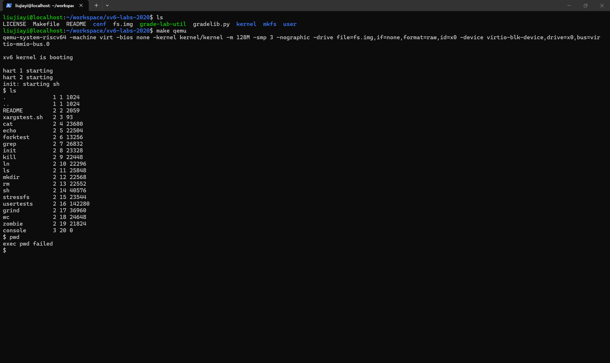

# lab0

## 成果

xv6 操作系统启动成功，图片见 [lab0.png](lab0.png)

## 遇到的问题

- 我使用的是 Windows 上的 WSL，我一开始安装的 ubuntu 版本是比 22.04 LTS 更高版本的 ubuntu ，然后在编译操作系统时总会在最后一步卡住无法出现 xv6 的 shell 

    然后 ai 提示说建议改为严格使用老师的示例中的 ubuntu 22.04 LTS，我在 wsl 中重新安装了这个版本的 ubuntu ，然后成功编译 xv6

- 一开始 codex 无法读取我电脑本机上的 wsl 中的文件，即使选择了正确的发行版以及正确路径也无法顺利读取

    然后我尝试将 ubuntu-22.04 LTS 设为 wsl 的默认发行版，然后 codex 就可以成功读取了