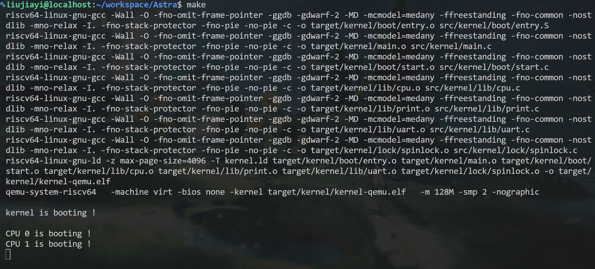
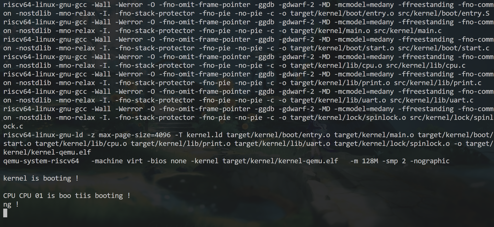

# Lab 1：机器启动

本次实验在 `lab1` 分支完成。接下来的文档内容顺序按照我写代码时的顺序来记录

## 1. 阅读原始代码

开始写代码前，我先阅读了 `Makefile`、`kernel.ld`、`entry.S` 和老师提供的目录结构，目的是搞清楚“内核从哪里开始运行、怎么被编译和加载”。

阅读过程中主要理解了：

- `Makefile` 会把 C 文件和汇编文件编译成 `.o` 文件，再链接成 `kernel-qemu.elf`；
- QEMU 使用 `-kernel target/kernel/kernel-qemu.elf` 加载内核，使用 `-smp 2` 启动两个 CPU；
- `kernel.ld` 决定 ELF 中 `.text`、`.rodata`、`.data`、`.bss` 等段在内存中的布局；
- `ENTRY(_entry)` 指定 ELF 的入口，因此内核最先执行的是 `entry.S` 中的 `_entry`；
- 两个 hart 都会从 `_entry` 开始执行，但通过 `mhartid` 得到不同的 CPU 编号；
- `entry.S` 根据 `mhartid` 计算每个 CPU 各自的初始栈顶，然后调用 `start()`。

这一阶段主要通过阅读老师的框架、Makefile 注释和 GPT 的解释理解概念。

同时在阅读的过程中我也根据自己的理解在 `entry.S` , `kernel.ld` 等文件中添加了我自己的注释

## 2. 完成 `start.c`

理解入口汇编后，我开始补全 `src/kernel/boot/start.c`。

这部分参考了 xv6 的 `start.c`，重点是理解其中的 `mstatus`、`mepc` 和 `mret`。一开始我对“设置 M-mode 的返回地址”有疑问：误以为这里应该填写将来从 S-mode 回到 M-mode 时的地址。

通过阅读 xv6 源码并询问 GPT 后，明确了实际流程：

1. 当前代码仍在 M-mode；
2. 修改 `mstatus` 中的 `MPP` 字段，将 `mret` 的目标特权级设置为 S-mode；
3. 把 `main()` 的函数地址写入 `mepc`；
4. 执行 `mret` 后，CPU 以 S-mode 跳转到 `main()`。

因此，我在 `start.c` 中完成了：

- `w_satp(0)`：暂时关闭分页；
- 读取 `mhartid`，写入 `tp`，让后续 S-mode 代码可以通过 `r_tp()` 获得 CPU 编号；
- 读取并修改 `mstatus.MPP`；
- `w_mepc((uint64)main)`；
- 执行 `mret`。

## 3. 完善 `main()`

完成 `start.c` 后，我尝试使用 `make run` 启动内核。

第一次编译时，`main()` 报错：

```text
control reaches end of non-void function
```

原因是 `main()` 的返回类型为 `int`，但函数执行到末尾时没有返回值。内核没有普通用户程序那样的“退出”概念，因此最后使用 `while (1) {}` 让内核持续运行，并保留 `return 0` 消除编译器警告。

之后又遇到 `print.c` 中 `printint()`、`printptr()` “defined but not used”的警告。因为 Makefile 开启了 `-Werror`，警告会被当成错误，导致尚未完成 `printf()` 时无法继续运行。为了先验证启动路径，我曾暂时注释 `-Werror`；后续应在代码整理完成后重新开启它。

当 QEMU 启动后终端没有自动返回提示符时，我一开始以为程序“卡住”了。后来确认这是正常现象：内核已经运行到最后的无限循环，因此 QEMU 不会自行退出。xv6 中出现的 `$` 是用户态 shell 启动后的提示符，本 Lab 还没有进程、文件系统和 shell，所以不会出现 `$`。

## 4. 实现 `printf()`

确认内核能够进入 `main()` 后，我开始阅读 `uart.c`。我发现无论输出整数、字符串还是单个字符，最终都需要调用 `uart_putc_sync()` 向串口逐字符发送数据。

因此，`printf()` 的任务是：

1. 读取格式字符串；
2. 根据 `%d`、`%p`、`%x`、`%c`、`%s` 读取可变参数；
3. 将结果转换为字符；
4. 逐字符调用 `uart_putc_sync()`。

这一部分参考了 xv6 的 `printf` 结构，并结合 GPT 解释了 C 的 `stdarg.h`。我使用 `va_list`、`va_start`、`va_arg` 和 `va_end` 实现可变参数读取。

实现时遇到的几个细节：

- `%c` 的参数不能写成 `va_arg(ap, char)`。可变参数调用中，`char` 会提升为 `int`，因此应写成 `va_arg(ap, int)`；
- 对于 `%%`，应输出一个普通的 `%`；
- 对于格式串末尾单独出现的 `%`，当前实现把它按普通字符输出；
- `\n` 不需要在 `printf()` 中额外解析，它在 C 源代码编译时已经变成换行字符，可以直接交给 UART 输出。

完成后，`main()` 可以调用：

```c
printf("CPU %d is booting!\n", r_tp());
```

输出当前 CPU 的启动信息。



## 5. 完善锁机制

仅能输出字符串还不够。因为 QEMU 使用 `-smp 2` 启动了两个 hart，两个 CPU 都会执行 `main()`，而 UART 却只有一个。

一次 `printf("CPU 0 is booting!\n")` 会多次调用 `uart_putc_sync()`。如果 CPU 0 输出到一半时 CPU 1 也开始输出，最终终端可能出现字符交错、乱码。这个现象也正是课后实验 4.2 想观察的内容。

为了理解如何解决这个问题，我阅读了 xv6 中的 `printf` 锁和 `spinlock.c`，并针对以下概念询问 GPT：

- 为什么两个 CPU 会共享全局变量和 UART；
- 为什么原子操作可以防止两个 CPU 同时拿到锁；
- 为什么拿锁前还要关闭中断；
- `push_off()` / `pop_off()` 中 `noff` 和 `origin` 的作用；
- `__sync_lock_test_and_set()` 和 `__sync_synchronize()` 的含义。

最终理解到：

- 原子交换保证多个 CPU 同时尝试上锁时，只有一个 CPU 能把 `locked` 从 `0` 改成 `1`；
- 关闭中断不是停止另一个 CPU，而是防止当前 CPU 在持锁期间被中断处理程序打断后再次尝试获取同一把锁；
- `noff` 是关中断的嵌套层数，只有最外层 `pop_off()` 才可能恢复原来的中断状态；
- `__sync_synchronize()` 是内存屏障，用来约束多核下的内存访问顺序。

随后在 `spinlock.c` 中完成了：

- `spinlock_init()`；
- `spinlock_holding()`；
- `spinlock_acquire()`；
- `spinlock_release()`；
- `push_off()`；
- `pop_off()`。

并在 `printf()` 开始时获取 `print_lk`，输出结束后释放它。这样一整条 `printf()` 的字符会连续输出，不会和另一条 `printf()` 的字符混合。

## 6. 处理 `print_init()` 的双核初始化顺序

加入锁后又出现了新的并发问题：`main()` 会被两个 CPU 同时执行，但 `print_init()` 只能初始化一次。

如果 CPU 1 先执行到 `printf()`，而 CPU 0 还没有完成 `uart_init()` 和 `spinlock_init()`，就可能使用到尚未初始化的 UART 或锁。因此，不能只依赖“CPU 0 通常先启动”的偶然顺序。

参考老师 README 中的示例，我在 `main.c` 中加入：

```c
volatile static int started = 0;
```

并按以下顺序同步：

1. CPU 0 执行 `print_init()`；
2. CPU 0 输出内核启动提示；
3. CPU 0 执行 `__sync_synchronize()`；
4. CPU 0 写入 `started = 1`；
5. CPU 1 自旋等待 `started == 1`；
6. CPU 1 执行 `__sync_synchronize()` 后再调用 `printf()`。

这样可以保证 CPU 1 在初始化完成前不会使用 UART 和打印锁。

需要注意的是：CPU 0 和 CPU 1 通过 `started` 后仍可能竞争 `print_lk`，因此两条 `CPU x is booting!` 的先后顺序不固定；但它们都在初始化完成后输出，并且每一条输出内部不会再出现字符级交错。


## 7. 课后实验

`4.1` 的并行加法我没有测试，但我测试了 `4.2` 的并行输出

我通过注释掉 `printf()` 函数中开头和结尾的

```c
// spinlock_acquire(&print_lk);
...
// spinlock_release(&print_lk);
```

然后观察了在无锁的情况下的并行输出效果



确实有乱码的情况出现


## 8. 当前完成情况

目前已经完成本实验的核心内容：

- 双核 QEMU 启动；
- `_entry -> start() -> main()` 启动路径；
- 从 M-mode 切换到 S-mode；
- UART 输出；
- 支持 `%d`、`%p`、`%x`、`%c`、`%s` 的 `printf()`；
- 使用自旋锁保护 `printf()` 的完整输出过程；
- 使用 `started` 和内存屏障保证双核初始化顺序。

本次实现过程中，GPT 主要用于解释 RISC-V 特权级切换、Makefile/链接脚本、可变参数、原子操作、中断嵌套和并发问题；xv6 源码主要用于参考启动代码、`printf` 和自旋锁的整体设计。