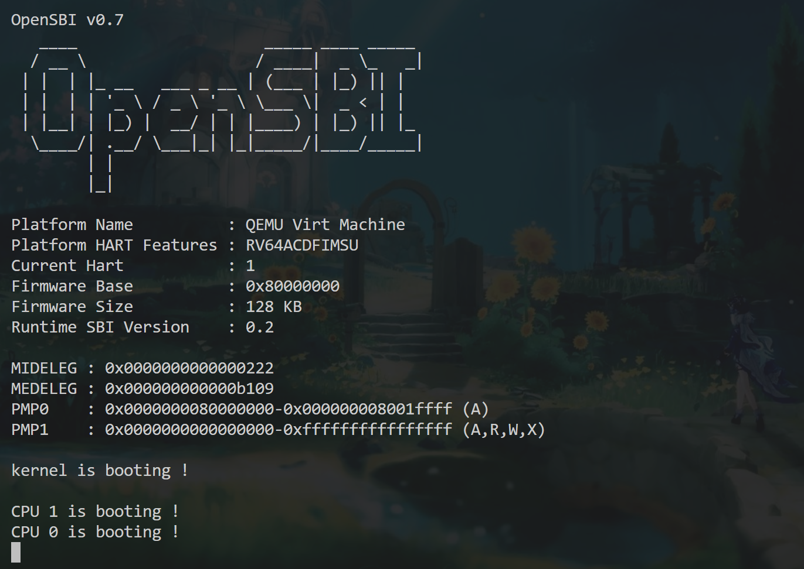
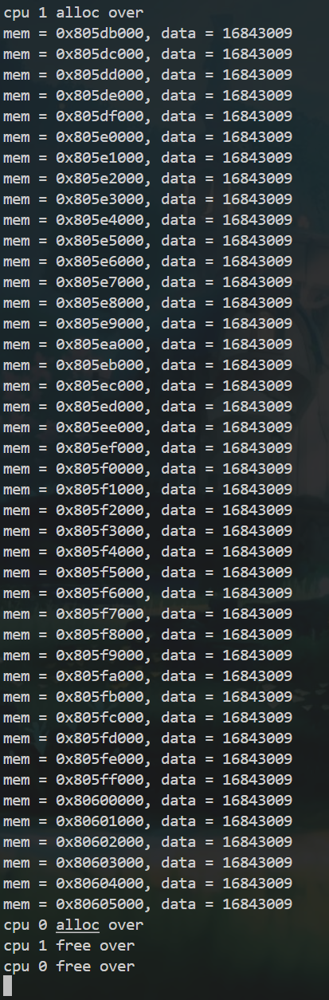
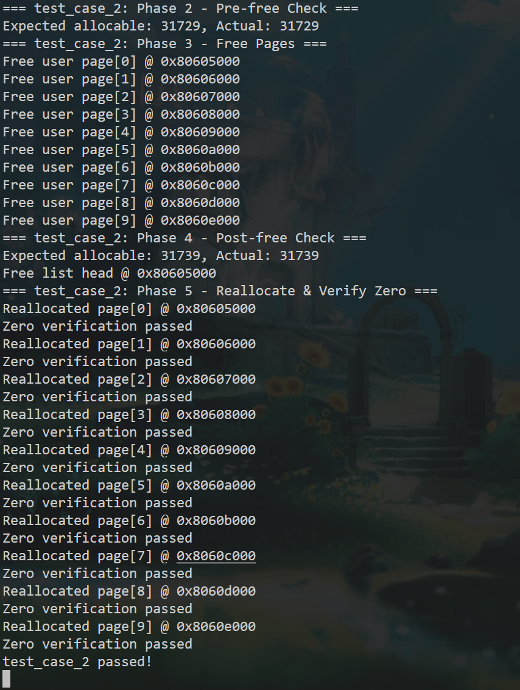
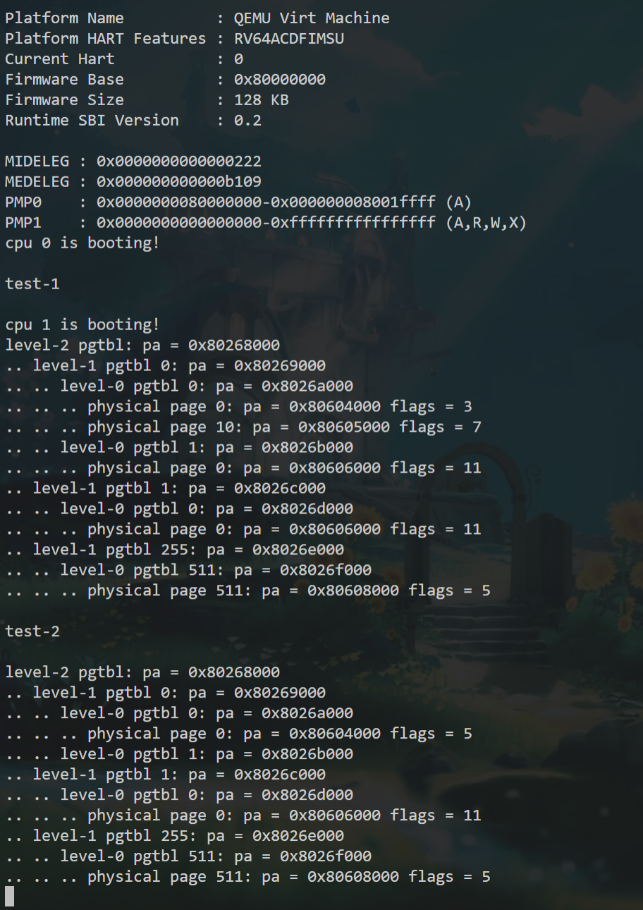
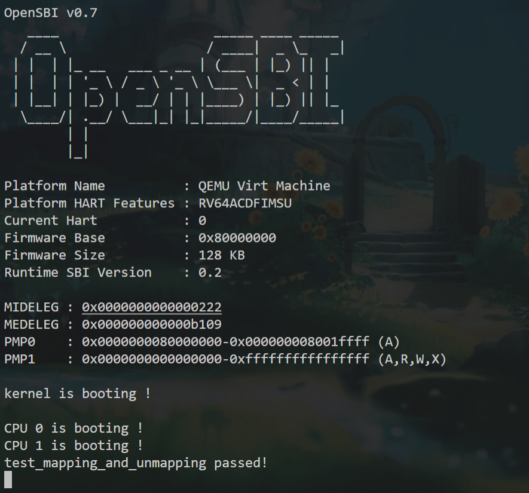

# Lab 2：内存管理初步

本实验在 `lab2` 分支完成。这里按实际写代码和调试的顺序记录，而不是重述教师 README。内容依据本仓库提交历史、源码、开发时与 Codex 的对话，以及留下的终端输出。Lab 2 没有直接参考 xv6 源码；遇到概念和代码问题时，我主要阅读教师提供的文件，并向 Codex 提问，再用编译和运行结果核对。

## 1. 先把 Lab 1 的启动方式改为 OpenSBI 启动

开始时，我按照教师 `README-teacher.md` 中的 `NEW`、`CHANGE`、`TODO` 标记同步 Lab 2 框架，并核对直接复制的文件。Astra 原来的 `README.md` 没有被教师说明覆盖。接着我阅读了 `Makefile`、`kernel.ld`、`entry.S`、`start.c` 和 `sbi.c`，先弄清新框架为什么把内核入口从 `0x80000000` 移到 `0x80200000`：前 2 MiB 留给 OpenSBI，内核从 S-mode 开始运行。

Lab 1 的 `start.c` 曾在 M-mode 读取 `mhartid`、设置特权级并执行 `mret`。这一版不能继续照搬这些操作。我修改了 `entry.S` 和 `start.c` 的衔接：OpenSBI 把 hart ID 放在 `a0`，`entry.S` 设置每个 hart 的栈，`start(uint64 hartid)` 把编号写入 `tp`，随后进入 `main()`。此时先用 `w_satp(0)` 关闭分页，等第三阶段建立页表后再切换。

OpenSBI 只自动启动一个 hart，其他 hart 要由内核调用 `sbi_hart_start()`。我在 `main.c` 中加上这一步，也处理了“谁负责一次性初始化”的问题。最初用普通的 `main_hart == -1` 判断主核，但两个 hart 同时读取时可能都认为自己获选；后来改成 `__sync_bool_compare_and_swap(&main_hart, -1, cpuid)` 这样的原子操作。获选的 hart 完成打印等初始化后，用内存屏障和 `started` 通知其他 hart；其他 hart 等待后再使用共享资源。我还调整过主核启动信息的打印位置，并暂时把 CPU 数增加到 5 检查锁，之后恢复为 2。上述调整在提交历史中都能找到。

我的这种原子操作 `main_hart` 的启动方式可以保证 `OpenSBI` 最先启动的 `Current Hart` 先打印启动信息，然后别的 `hart` 再打印启动信息

## 2. 读链接布局，再初始化物理页链表

开始写 `pmem.c` 前，我先读 `kernel.ld` 和 `mem/type.h`。当时有几个基础疑问：`KERNEL_BASE` 到 `ALLOC_BEGIN` 是否也能分配？`kern_region` 和 `user_region` 是两个页表吗？C 代码怎样取得链接脚本里的 `ALLOC_BEGIN`？与 Codex 核对后，我明确只有 `ALLOC_BEGIN ~ ALLOC_END` 是动态分配区；两个 `alloc_region_t` 是空闲物理页链表的管理结构，不是虚拟内存页表。内核区从 `ALLOC_BEGIN` 起占前 `KERN_PAGES` 页，剩下的归用户区。

我先写 `pmem_init()`，分别填好两个区域的起止地址、可分配页数和锁，再把每个 4 KiB 页串起来。写链表时我曾想另建一个局部头节点，也不确定 `list_head` 是否占掉一页。后来确认 `list_head` 是 `alloc_region_t` 内嵌的哨兵；真正第一个空闲页是 `list_head.next = ALLOC_BEGIN`。空闲页的前几个字节暂存下一个页的指针，分配出去后整页才成为普通内存。这里也让我弄清：链接符号声明为 `char[]`，做地址计算时需要区分指针和 `uint64` 地址，不能把它们混用。

## 3. 依次实现申请、释放和报错接口

`pmem_init()` 后，我写 `pmem_alloc(bool in_kernel)`。最初疑惑“清零后的物理页”是什么意思，以及返回 `void *` 是否仍是一个页的起始地址。理解后，我让 `in_kernel` 选择对应区域，从空闲链表取出第一页、更新 `allocable`，再用 `memset(..., 0, PGSIZE)` 清零后返回。

这里我反复和 Codex 核对过锁的位置：必须先拿锁，再读取 `list_head.next`；如果读完页地址才上锁，两个 hart 可能拿到同一页。修改后，链表头和页数的更新都在锁内。内存耗尽时先释放锁，再调用报错接口，避免带锁进入死循环。

写到失败分支时，我发现 Lab 1 留下的 `assert()` 还没有真正检查条件，于是先回到 `print.c` 补全它：断言失败调用 `panic()` 打印原因并停止。接着实现 `pmem_free()`，检查页是否在所选区域、是否按 4 KiB 对齐、是否已经在空闲链表中，再按地址插回并恢复页数。释放链表头、在空链表中插入、插到尾部等情况，我都在写函数时逐个向 Codex 核对过，而不是一次写完就假定正确。

## 4. 物理内存测试中遇到的地址和输出差异

我把教师的双核物理页申请与释放样例临时放入 `main.c` 运行。自己的输出中，地址写成 `80605000`，老师截图中可见的地址写成 `0x0000000080407000`，我一度怀疑“地址不一样，是否分配错了”。后来分开检查了两件事：

1. **数值**：依据当时构建的 `ALLOC_BEGIN` 和 1024 个内核页计算，自己输出中的页地址落在当前内核区。并发打印会交错，老师截图也不一定包含完整日志，不能把截图最后一行当作分配器的最大地址。
2. **格式**：当时自己实现的 `printf("%p")` 不输出 `0x` 和前导零；这是 `print.c` 的格式化方式，与分配器给出的地址数值是两回事。之后我调整了 `%p` 的输出。

我又测试了教师的 `test_case_2`。终端记录显示 10 个用户页从 `0x80604000` 开始逐页分配；申请后的空闲页数期望值和实际值都是 `31730`，释放后都恢复到 `31740`；重新申请的 10 页都打印了 `Zero verification passed`，最后输出 `test_case_2 passed!`。我当时也向 Codex 确认手动运行的内存耗尽测试 `test_case_1` 通过，但没有保留那一次的完整日志，因此不在这里编造具体输出。物理内存测试代码后来从正常启动版 `main.c` 中移除。

## 5. 理解三级页表后写 `vm_getpte()`

进入虚拟内存阶段时，我并没有马上看懂教师注释里的 `VPN[2]`、`VPN[1]`、`VPN[0]` 和 `PTE`。我问过 Codex：顶级 PTE 本身是不是下级页表的地址？`PA_TO_PTE` 会不会自动设置有效位？`vm_getpte()` 是返回物理页地址，还是返回末级 PTE？这些问题弄清后，我才开始写遍历：从传入的顶级页表出发，按 `VA_TO_VPN(va, level)` 逐级索引；父 PTE 中的 PPN 经 `PTE_TO_PA` 才能得到下级页表页的地址。

如果中间层 PTE 无效，`alloc == false` 时不能凭空找到下级页表；`alloc == true` 时才从内核区申请一个清零页，并把其地址和 `PTE_V` 写入父 PTE。我最初曾把 `PTE_CHECK()` 用在 PTE 指针上，也试过在 `vm_getpte()` 中直接给末级 PTE 设置 `V`。后续检查和提交修改让我明确：前者应该检查 `*pte` 的值；后者只负责找到末级 PTE 的位置，是否建立有效的物理页映射由 `vm_mappages()` 决定。

## 6. 写映射、解映射时确定各函数的责任

实现 `vm_mappages()` 时，我继续追问过 `len` 是否必须是整页倍数，以及 `perm` 到底控制哪些位。教师样例存在 `PGSIZE / 2` 和 `PGSIZE - 1` 的长度，所以我的循环按覆盖到的页数处理，不要求 `len` 必须是整页。对每一页，先用 `vm_getpte(..., true)` 找末级 PTE，再写入 `PA_TO_PTE(pa)` 对应的页号、`R/W/X` 权限和有效位。起初我想让 `perm` 决定 `PTE_V`，后来发现教师调用传入的是 `PTE_R`、`PTE_R | PTE_W` 等权限；如果只从 `perm` 取 `V`，这些映射会保持无效，因此建映射时要明确设置 `V`。

随后我实现 `vm_unmappages()`：用 `vm_getpte(..., false)` 找已有末级 PTE，按 `freeit` 决定是否释放它指向的用户物理页，最后把叶子 PTE 清零。写这段时我也专门问过“只清 `V` 位还是清整项”，最终选择清整项，避免旧页号和权限残留。页表中间层本身的释放函数本实验还没有实现，教师测试也明确说明测试页表可以暂不释放。

## 7. 最后建立内核页表，并调整逐核启用顺序

准备 `kvm_init()` 时，我先把需要映射的范围逐项列出：UART、PLIC、内核代码、内核数据、可分配区域。曾误以为除了 OpenSBI 的前 2 MiB，其他地址都应直接映射；与 Codex 对照教师说明、设备宏和链接脚本后，改为只映射内核需要访问的 RAM 与设备地址。UART 按一页映射，PLIC 由 `PLIC_BASE` 和 `PLIC_SIZE` 确定；这些区域都采用 `VA == PA`。

我也问过这五段的权限是否由老师明确规定。教师文档说明了区域和 PTE 标志，却没有逐项列出 `perm`，所以我是按用途确定设备与数据为 `PTE_R | PTE_W`、代码为 `PTE_R | PTE_X`。第一次计算代码区长度时，把链接符号 `KERNEL_DATA` 当整数直接相减；经 Codex 提醒，先将它转成 `uint64` 地址。因为数据区和可分配区的权限一样，当前代码把这两段合并为一次映射，五个区域共调用四次 `vm_mappages()`。

把它接入 `main.c` 时，我第一次把 `kvm_inithart()` 放在 `kvm_init()` 之前，还在其他 hart 上重复调用 `kvm_init()`。Codex 检查后指出：共享页表还未建立就写 `satp` 会出错，其他 hart 也不应重建同一张页表。于是改为主核按 `pmem_init() → kvm_init() → kvm_inithart()` 执行，设置 `started` 后再启动其他 hart；其他 hart 等待后只调用 `kvm_inithart()`。后来开启 `-Werror` 编译通过，QEMU 中两个 CPU 在启用页表后都打印了启动信息。

## 8. 第三阶段 test-1：`Invalid len` 的来源

我把教师第三阶段的 test-1 临时复制进 `main.c`。首次运行打印了 `test-1`，马上出现 `panic! Invalid len`，并没有进入 `vm_print()`。Codex 对照测试调用和我的参数检查，定位到第一条映射 `vm_mappages(test_pgtbl, 0, mem[0], PGSIZE, PTE_R)`：我写的 `va + len > len` 在 `va == 0` 时必然不成立，却把合法的虚拟地址 0 排除掉了。

当时我把 `vm_mappages()` 检查中的两个 `>` 改成了 `>=`，重新运行后输出了 test-1 的页表信息。测试代码后半段标为 `test-2`，它把虚拟地址 0 的映射权限从读改为写，并解除另外两项映射；第二次 `vm_print()` 中，地址 0 的 flags 由 `3` 变成 `5`，被解除映射的物理页条目不再出现。之后我也把 `vm_unmappages()` 中同类的边界条件改为 `>=`。这种改法让样例通过，但两个函数中还有冗余条件，地址 0 的解映射也未单独补测，后续应整理。

## 9. 第三阶段 test-2：样例本身的括号问题

接着我把教师的 `test_mapping_and_unmapping()` 放在 `main()` 前，只让主核在物理内存和内核页表初始化完成后调用。第一次用 `-Werror` 编译时，编译器指出样例的 `*pte & PTE_R == PTE_R` 缺少括号。按 C 运算符优先级，它不能正确验证读权限；我改成 `(*pte & PTE_R) == PTE_R` 后重新运行。

最终终端打印 `test_mapping_and_unmapping passed!`。这说明该样例里的两次映射、物理地址和权限检查、两次解映射及有效位检查通过。测试没有切换到临时页表并实际访问那两个虚拟地址；测试函数也已从正常启动版 `main.c` 移除。

## 10. 当前结果与还没验证的地方

当前正常启动版已在 `-Werror` 下执行 `make build` 成功；短时运行 QEMU 时，两个 CPU 都在切换内核页表后打印了启动信息。物理内存的 `test_case_2` 和第三阶段两个教师样例有当时的终端输出支持；内存耗尽测试的通过结论来自我在旧对话中的手动测试反馈。截图链接仍待我用真实运行结果补齐。

本次没有把“老师样例通过”写成“所有情况都正确”：例如虚拟地址 0 的解映射、更多非法参数和长期并发行为没有逐项验证。Lab 2 的实现主要依据教师 README、仓库已有代码和实际调试；Codex 用于帮助我弄清概念、检查代码顺序及定位报错，本次没有直接参考 xv6 源码。